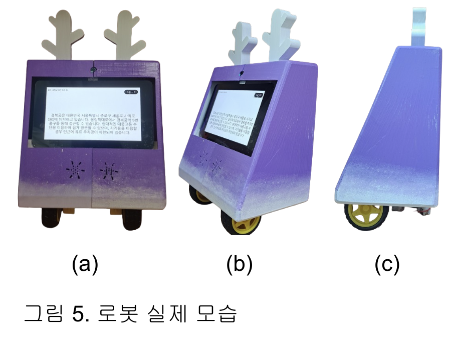
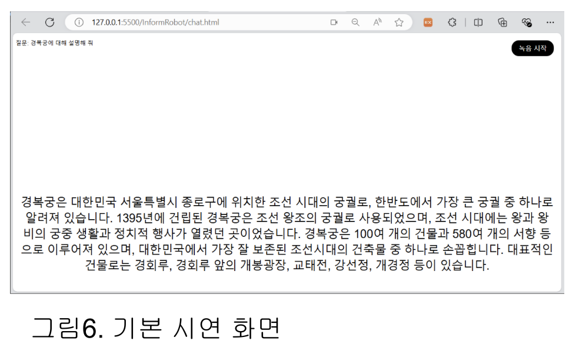
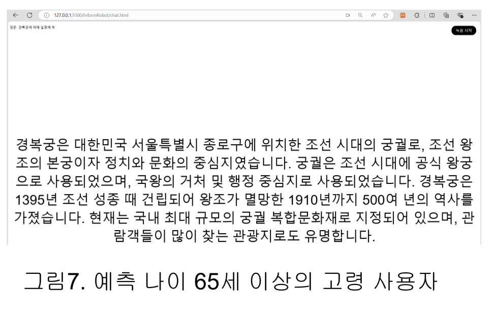
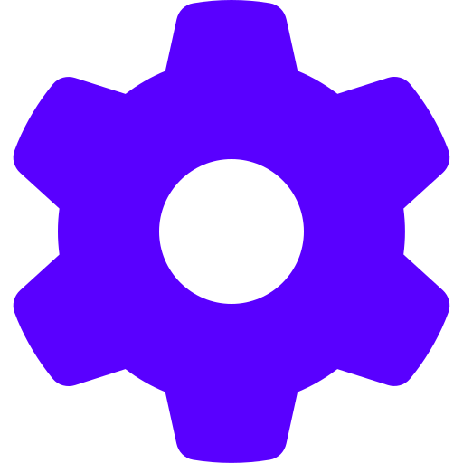

<div align="center">



# InformRobot
### 얼굴인식을 활용한 연령별 대응 로봇 시스템

> **계정 이전 안내** : 기존 계정(`jga-eun`)에서 현재 계정(`gaeun-jay`)으로 이전된 레포지토리입니다.

</div>

<br/>

##  &nbsp;프로젝트 배경 및 목적

디지털 시대의 도래와 함께 은행, 병원, 행정기관 등 공공기관에서 키오스크 설치가 급증하였으나, **사용자 맞춤형 대응이 어렵다**는 한계가 존재합니다.

특히 고령층 사용자는 디지털 기기에 익숙하지 않아 키오스크 사용을 기피하는 경향이 있으며, 공공기관 특성상 부서가 세분화되어 있어 올바른 정보를 얻기 어려운 경우도 많습니다.

이를 해결하기 위해 **얼굴 인식 기반 연령 분석**으로 사용자를 구분하고, 연령에 맞는 맞춤형 정보를 제공하는 안내 로봇 시스템을 개발하였습니다.

<br/>

##  &nbsp;학습 목표

- 딥러닝 기반 얼굴 인식(DeepFace) 모델의 실제 적용
- STT / TTS / LLM API를 활용한 자연어 인터랙션 구현
- YOLOv5 및 OpenCV를 이용한 실시간 장애물 감지 및 자율주행 로직 구현
- 3D 프린팅 및 Fusion 360을 활용한 하드웨어 설계 및 제작

<br/>

##  &nbsp;팀 구성 및 담당 역할

- **프로그램** : 2024년 성신여자대학교 하계 학부생 연구프로그램 (UROP)
- **지도교수** : 성신여자대학교 AI융합학부 강종구 교수님
- **개발 기간** : 2024.04 ~ 2024.08
- **팀원 수** : 2인

| 역할 | 담당자 |
|------|--------|
| 하드웨어 설계 (Fusion 360 모델링, 3D 프린팅, 부품 조립) | 공동 |
| 소프트웨어 개발 (Flask 서버, API 연동, 얼굴인식, 자율주행) | 공동 |

프로젝트 세부 과정은 다음과 같습니다.

| 작업 | 설명 |
|------|------|
| 로봇 본체 설계 | Fusion 360으로 로봇 외형 모델링, ABS 필라멘트로 3D 프린팅 |
| 하드웨어 조립 | 라즈베리파이4, 디스플레이, 카메라, 스피커, 마이크 조립 |
| 백엔드 개발 | Flask 기반 서버 구축, OpenAI GPT API 연동 |
| 얼굴 인식 | DeepFace(VGG-Face) 모델로 실시간 연령 분석 구현 |
| 음성 처리 | Google Cloud STT / TTS API 연동 |
| 자율주행 | YOLOv5 객체 감지 + OpenCV Edge Detection 기반 장애물 회피 |

<br/>

##  &nbsp;주요 기능

### 1. 연령별 맞춤 응대
- 웹캠을 통해 실시간으로 얼굴을 인식하고 **DeepFace(VGG-Face)** 모델로 나이를 예측
- 노인복지법 기준(65세)에 따라 고령 사용자에게는 **글자 크기 2배 확대**, **음성 속도 0.8배** 조절 제공

<div align="center">
  <table>
    <tr>
      <th>기본 응답 화면 (65세 미만)</th>
      <th>고령 사용자 응답 화면 (65세 이상)</th>
    </tr>
    <tr>
      <td></td>
      <td></td>
    </tr>
  </table>
</div>

### 2. 음성 기반 질의응답
- 녹음 버튼 클릭 → **Google Cloud STT**로 음성을 텍스트 변환
- **GPT-4o API**가 사용자 질문에 맞는 답변 생성
- **Google Cloud TTS**로 답변을 음성으로 출력

### 3. 자율주행 및 장애물 회피
- **YOLOv5** : 사람, 반려동물, 가방 등 80종 객체 감지 → 프레임의 50% 이상 점유 시 장애물로 판단
- **OpenCV Edge Detection + Dilation** : 벽 감지 후 정지 및 우회전 신호 제공

### 4. 감정 표현 UI
- 대기 중 다양한 표정 애니메이션 출력
- 오류 발생 시 별도 에러 표정으로 상태 표시

<br/>

##  &nbsp;관련 논문

본 프로젝트는 2024년 학부 연구(UROP) 과정에서 진행되었으며, 아래 논문으로 연구 결과를 정리하였습니다.

> **얼굴인식을 활용한 연령별 대응 로봇 시스템 개발**
> *Development of age-appropriate robot system using face recognition*
> 2024 UROP (Undergraduate Research Opportunities Program)
> 📄 [논문 보기](assets/2024_UROP_Development%20of%20age-appropriate%20robot%20system%20using%20face%20recognition.pdf)

**연구 요약**

키오스크 사용에 어려움을 겪는 고령층을 위해 얼굴 인식 기반 연령 분석 시스템을 개발하였습니다. DeepFace 모델(±4.6년 오차)로 실시간 나이를 예측하고, 65세 이상 사용자에게는 UI 및 음성 출력을 자동으로 조정합니다. 향후 LiDAR 센서를 도입하여 3D 맵 기반 자율주행으로 발전시킬 예정입니다.

| 항목 | 내용 |
|------|------|
| 얼굴 인식 모델 | DeepFace (VGG-Face) |
| 나이 예측 오차 | ±4.6년 |
| 고령 기준 | 65세 이상 (노인복지법 기준) |
| 향후 개선 | LiDAR 센서 기반 3D 맵 자율주행 |

<br/>

##  &nbsp;기술 스택

<table>
  <tr>
    <th>분류</th>
    <th>기술</th>
  </tr>
  <tr>
    <td>Language</td>
    <td>
      
      
      
      
    </td>
  </tr>
  <tr>
    <td>Framework / Library</td>
    <td>
      
      
      
    </td>
  </tr>
  <tr>
    <td>AI / ML</td>
    <td>
      
      
      
    </td>
  </tr>
  <tr>
    <td>Cloud API</td>
    <td>
      
      
    </td>
  </tr>
  <tr>
    <td>Hardware</td>
    <td>
      
      
    </td>
  </tr>
</table>

<br/>

##  &nbsp;미구현 기능

| 기능 | 설명 |
|------|------|
| LiDAR 기반 자율주행 | 현재 카메라 예측 방식 → LiDAR 센서로 3D 맵 생성 후 정밀 주행 |
| 연령 예측 정확도 개선 | 어린이(9~11세) 구간 오차 크므로 추가 보정 필요 |

<br/>

##  &nbsp;프로젝트 구조

```
InformRobot/
├── app.py                  # Flask 메인 서버 (STT, TTS, GPT, YOLO, 얼굴인식)
├── .gitignore
├── assets/
│   ├── icons/                # 섹션 아이콘 SVG
│   ├── robot.png             # 로봇 실제 사진
│   ├── age_basic.png         # 기본 응답 화면 스크린샷
│   ├── age_65.png            # 고령 사용자 응답 화면 스크린샷
│   └── 2024_UROP_Development of age-appropriate robot system using face recognition.pdf
└── static/
    ├── chat.html           # 채팅(질문) UI
    ├── chat.js             # 음성 녹음 및 질의응답 로직
    ├── chat.css            # 채팅 UI 스타일
    ├── Robot.html          # 로봇 표정 메인 화면
    ├── Robot.js            # 표정 전환 로직
    ├── Robot.css           # 로봇 UI 스타일
    ├── adapter.min.js      # WebRTC 어댑터
    └── image/
        ├── emo1.jpg ~ emo4.jpg   # 표정 이미지
        ├── error.jpg             # 에러 표정
        └── chat.jpg              # 채팅 화면 이미지
```

<br/>

##  &nbsp;설치 및 실행

### 1. 환경 변수 설정

`.env` 파일을 생성하고 아래 내용을 입력합니다.

```env
OPENAI_API_KEY=your_openai_api_key
GOOGLE_APPLICATION_CREDENTIALS=path/to/your/google_credentials.json
```

### 2. 패키지 설치

```bash
pip install flask flask-cors opencv-python torch openai google-cloud-speech google-cloud-texttospeech deepface python-dotenv
```

### 3. SSL 인증서 생성 (로컬 테스트용)

```bash
openssl req -x509 -newkey rsa:4096 -keyout server.key -out server.crt -days 365 -nodes
```

### 4. 서버 실행

```bash
python app.py
```

브라우저에서 `https://localhost:5000` 접속
